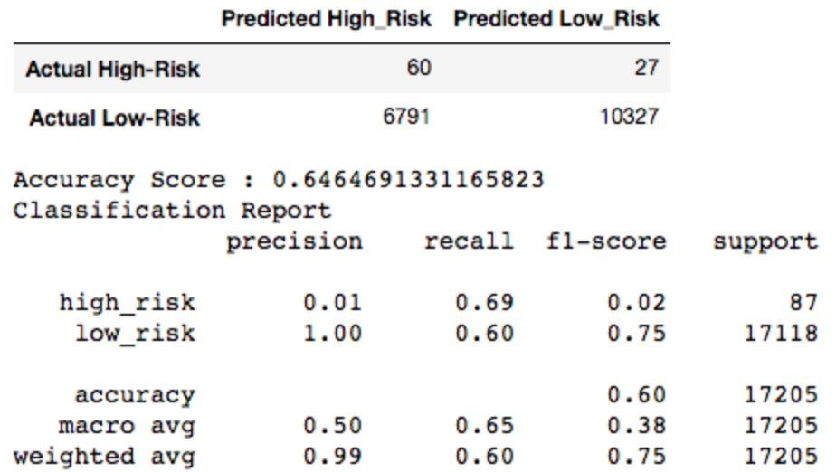
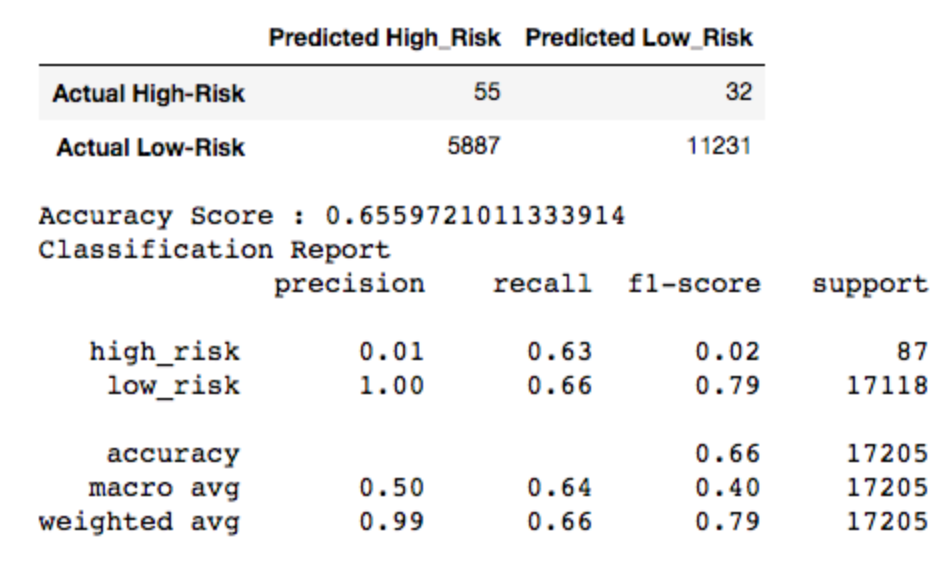
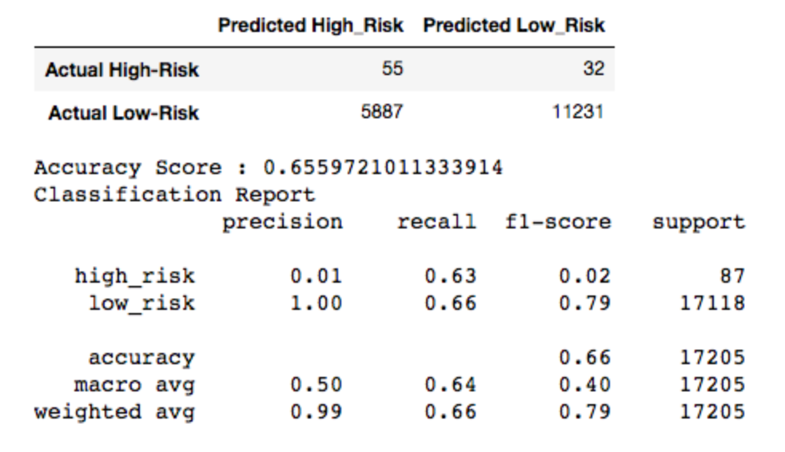
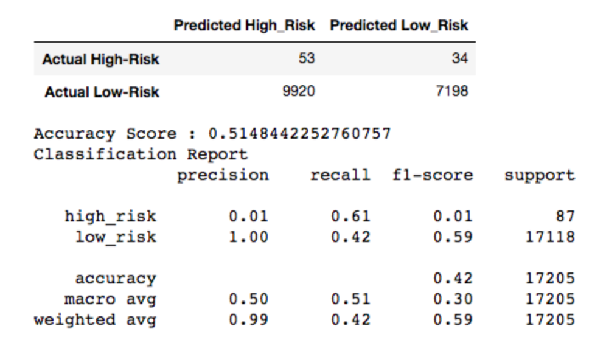
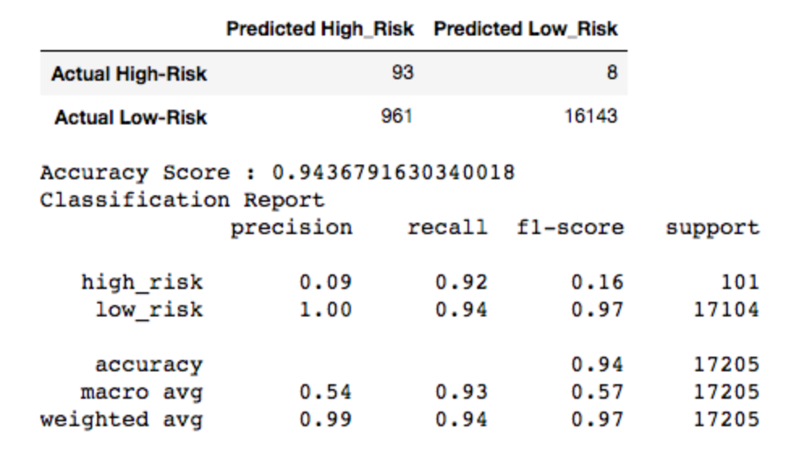
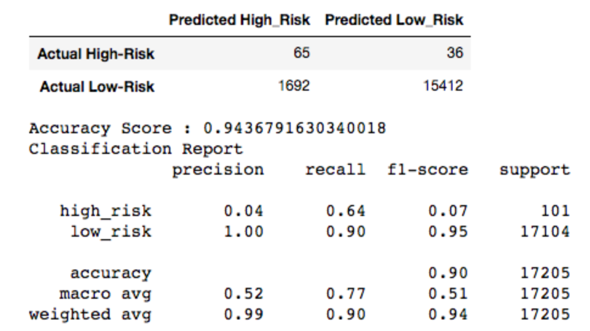

# Credit-Risk-Analysis

# Overview
Jill commends you for all your hard work. Piece by piece, you’ve been building up your skills in data preparation, statistical reasoning, and machine learning. You are now ready to apply machine learning to solve a real-world challenge: credit card risk.

Credit risk is an inherently unbalanced classification problem, as good loans easily outnumber risky loans. Therefore, you’ll need to employ different techniques to train and evaluate models with unbalanced classes. Jill asks you to use imbalanced-learn and scikit-learn libraries to build and evaluate models using resampling.

Using the credit card credit dataset from LendingClub, a peer-to-peer lending services company, you’ll oversample the data using the RandomOverSampler and SMOTE algorithms, and undersample the data using the ClusterCentroids algorithm. Then, you’ll use a combinatorial approach of over- and undersampling using the SMOTEENN algorithm. Next, you’ll compare two new machine learning models that reduce bias, BalancedRandomForestClassifier and EasyEnsembleClassifier, to predict credit risk. Once you’re done, you’ll evaluate the performance of these models and make a written recommendation on whether they should be used to predict credit risk.

# Results

**Deliverable 1**
For all three algorithms, the following have been completed:

- An accuracy score for the model is calculated

- A confusion matrix has been generated

- An imbalanced classification report has been generated

**Deliverable 2**
The combinatorial SMOTEENN algorithm does the following:

- An accuracy score for the model is calculated

- A confusion matrix has been generated

- An imbalanced classification report has been generated

**Deliverable 3**
The BalancedRandomForestClassifier algorithm does the following:

- An accuracy score for the model is calculated

- A confusion matrix has been generated

- An imbalanced classification report has been generated

- The features are sorted in descending order by feature importance
        
The EasyEnsembleClassifier algorithm does the following:
    
- An accuracy score of the model is calculated

- A confusion matrix has been generated

- An imbalanced classification report has been generated

# Summary

For all models, utlizing EasyEnsembleClassifier is the most effective. Provides a highest Score for all Risk loans. The precision is low or none for all the models. In General, above the 90% of the current analysis, utlizing EasyEnsembleClassifier will perform a High-Risk loan precision as a great value for the overall analysis.
